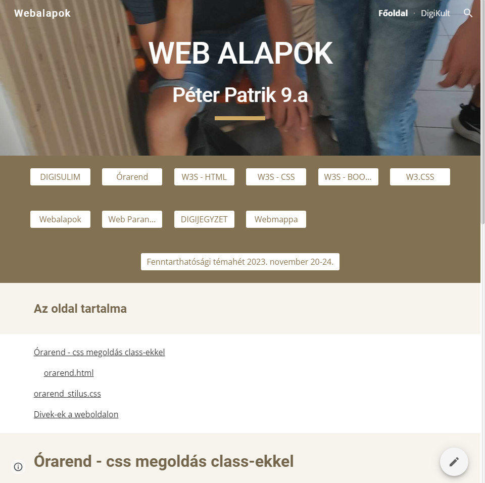
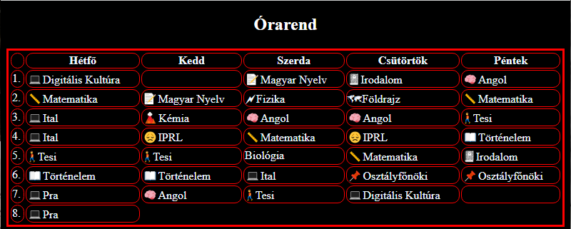

<!DOCTYPE html>
<html lang="en">

<head>
    <meta charset="UTF-8">
    <meta http-equiv="X-UA-Compatible" content="IE=edge">
    <meta name="viewport" content="width=device-width, initial-scale=1.0">
    <title>Cards</title>
    <link rel="stylesheet" href="cards.css">
</head>

<body>
    

        
        

            <h2>My webpage</h2>
            
This is my "Webalapok" named webpage. 

        

    

    

        
        

            <h2>My timetable</h2>
            
This is my timetable. 

        

    

    

        
        

            <h2>I don't what is this</h2>
            
some random picture about some random webpage. 

        

    

</body>

</html>
